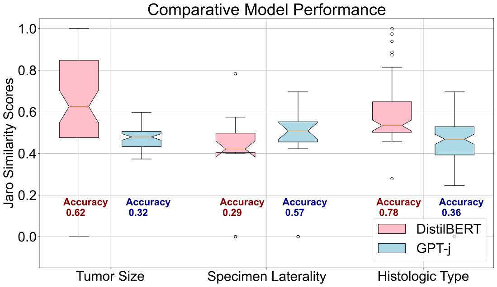

# Using Large Language Models for the Automatic Synoptic Report Generation  

  
  <em>The figure shows the performance of DistilBERT and GPT-J on the task of extracting a synoptic report's elements from a pathological report. The figure shows the results from 100 test examples, on three sample categories of the synoptic report. The edges of the boxplot represent the 25th percentile and the 75th percentile, the central notch and line the median (50th percentile), and the whiskers are the 5th and 95th percentile markers.</em>

